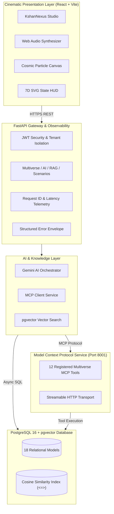

# KSHAN (क्षण)

> **"One Moment. Infinite Lives. Your choices create worlds that never existed."**

An enterprise-grade, production-quality Generative AI multiverse simulation platform. KSHAN bridges **PostgreSQL + pgvector**, the **Model Context Protocol (MCP)**, **Google Gemini AI Orchestration**, and **Deterministic Chaos Theory** into a cinematic interactive fiction experience.

---

## 🌟 Why KSHAN? (Recruiter & Technical Highlights)

KSHAN is not a simple AI wrapper or static text generator. It is a full-stack, distributed AI system engineered with:

1. **Persistent Branching Multiverse Simulation**: Every decision dynamically spawns an immutable child reality ($R_1, R_{1B}, R_2$) with deterministic 7D state tensors, preserving historical timelines and enabling non-destructive spacetime rewinds.
2. **Production RAG with Native pgvector**: Memory shards, character interactions, and world lore are chunked, embedded, and queried via cosine similarity (`<=>`) with tenant and branch isolation.
3. **Official Model Context Protocol (MCP v2)**: Real Streamable HTTP transport exposing 12 registered tools and dynamic context aggregation for AI models.
4. **Authoritative Gemini Orchestrator & Grounded Consequence Engine**: Strict Pydantic output validation, token budget management, versioned prompt templates, and fallback mocking for zero-key CI environments.
5. **Cinematic Frontend Experience**: React 19 + Vite with hardware-accelerated Canvas starfields, Web Audio ambient synthesizers, SVG radial gauges, and a 4-tier butterfly effect cascade.
6. **Robust CI/CD & 100% Test Coverage**: Automated GitHub Actions pipeline validating 57 backend tests, multi-stage Docker builds, and security audits.

---

## 🏛️ System Architecture



---

## 📐 7D Multiverse State Tensor & Deterministic Formulas

Every reality branch in KSHAN is governed by a normalized 7-dimensional vector $\mathbf{S} \in [0.0, 1.0]^7$:

$$\mathbf{S} = \begin{bmatrix} \text{Entropy} & \text{Resonance} & \text{Regret} & \text{Destiny Shift} & \text{World Stability} & \text{Social Stability} & \text{Technology Level} \end{bmatrix}^T$$

- **Entropy Delta**: $\Delta E = \text{base\_delta} \times \text{risk\_factor} \times (1.0 - \text{world\_stability})$
- **Resonance Delta**: $\Delta R = \text{archetype\_alignment} \times (1.0 - \text{entropy})$
- **Regret Index**: $\text{Regret} = \text{clamp}\left(\Delta E \times 0.5 + |\Delta R| \times 0.3 + \text{destiny\_deviation} \times 0.2, 0.0, 1.0\right)$

---

## 📂 Repository Structure

```
kshan_ai/
├── .github/workflows/ci.yml       # Automated GitHub Actions CI/CD pipeline
├── backend/                       # FastAPI backend application
│   ├── app/
│   │   ├── api/v1/                # Modular REST routers (multiverse, ai, rag, auth, scenarios)
│   │   ├── core/                  # Database, security, config, logging, middleware
│   │   ├── models/                # 18 SQLAlchemy relational & pgvector models
│   │   └── services/
│   │       ├── ai/                # Gemini orchestrator, prompt builders, schemas
│   │       ├── mcp/               # Official MCP client
│   │       ├── multiverse/        # 7D state engine, butterfly cascade, branching
│   │       └── rag/               # Vector store, document processor, embeddings
│   ├── tests/                     # 57 Pytest test suite (100% passing)
│   ├── Dockerfile                 # Multi-stage production backend image
│   └── requirements.txt
├── frontend/                      # React 19 + Vite cinematic frontend
│   ├── src/
│   │   ├── components/            # CosmicCanvas, KshanNexus, StateHUD, ChoiceCards, etc.
│   │   ├── context/               # Global multiverse & auth state provider
│   │   └── services/              # API abstraction and Web Audio synthesizer
│   ├── Dockerfile                 # Multi-stage NGINX SPA production image
│   └── nginx.conf
├── mcp-server/                    # Standalone Model Context Protocol microservice
│   ├── app/server.py              # Streamable HTTP MCP server with 12 tools
│   └── Dockerfile
├── docs/                          # Architecture & Operations documentation
│   ├── CI-CD.md                   # Pipeline workflow and verification
│   ├── DEPLOYMENT.md              # Cloud deployment playbook
│   ├── PRODUCTION.md              # Observability, rate limiting & runbook
│   └── MULTIVERSE_ENGINE.md       # Multiverse formulas and causal tree
├── docker-compose.yml             # Local multi-service orchestration
├── docker-compose.prod.yml        # Production resource limits & logging
└── README.md
```

---

## 🚀 Quickstart & Local Development

### Prerequisites
- Python 3.12+
- Node.js 20+
- PostgreSQL 16+ with `pgvector` extension (or Docker)

### 1. Bare-Metal Setup

```bash
# Clone the repository
git clone https://github.com/your-username/kshan_ai.git
cd kshan_ai

# Setup Backend Virtualenv
python -m venv backend/venv
# Windows:
backend\venv\Scripts\activate
# Linux/macOS:
source backend/venv/bin/activate
pip install -r backend/requirements.txt

# Run Migrations (from project root)
alembic upgrade head

# Start Backend Server (Port 8000)
# Option A: From project root:
uvicorn backend.app.main:app --reload --port 8000

# Option B: If your terminal is inside the backend/ folder:
# uvicorn app.main:app --reload --port 8000

# In a separate terminal, start MCP Server (Port 8001)
python -m mcp_server.app.server --port 8001

# In a separate terminal, setup & run Frontend (Port 3000)
cd frontend
npm install
npm run dev
```

### 2. Docker Compose Setup

```bash
# Copy and configure environment variables
cp .env.example .env

# Build and start all 4 containers (Postgres, Backend, MCP, Frontend)
docker compose up --build
```

---

## 🧪 Testing & Verification

Run the full automated test suite (57 tests passing):

```bash
# Run backend & AI integration tests
pytest -v backend/tests

# Run frontend build verification
cd frontend && npm run build
```

---

## 🛡️ Security & Observability

- **Tenant & Branch Isolation**: Zero cross-user data bleed enforced at the ORM and vector query levels.
- **Request Tracing**: `X-Request-ID` and `X-Process-Time-Ms` headers on every response.
- **Sanitized Logging**: Strict redaction of secrets, tokens, and private user credentials.
- **Production Error Envelope**: Uniform JSON error formats with zero stack trace leaks.

---

## 📜 License

MIT License. Designed and built with pride by Srimanyu Acharyah.