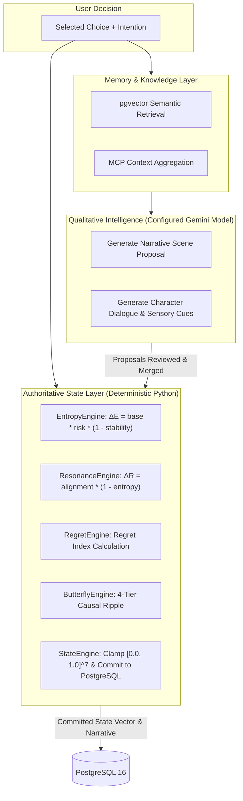

# KSHAN — AI Orchestration & The Authoritative Multiverse Engine

## The Core Question: Why Isn't the LLM Authoritative for Multiverse State?

In naive generative games, the LLM is asked to both write the narrative **and** update game variables (e.g. *"You gained 10 health and 5 entropy"*). This approach reliably fails in production due to:
1. **Mathematical Drift & Inconsistency**: LLMs frequently invent non-existent variables, jump numbers outside valid bounds, or hallucinate impossible state transitions.
2. **State Irreversibility & Divergence Incoherence**: When a user rewinds or compares branches, an LLM cannot guarantee mathematical commutativity or deterministic recalculation.

### The KSHAN Hybrid Solution

---

## 1. Qualitative Generation vs. Quantitative Authority

- **Configured Gemini Generative Model (via `GEMINI_MODEL`)**:
  - Generates immersive sensory descriptions, atmospheric prose, and character dialogue.
  - Receives structured system prompts (`KSHAN_SYSTEM_PROMPT_V1`), active world lore, and recent memory shards.
  - Returns structured Pydantic outputs (`StoryProposalResponse`, `BranchChoicesResponse`, `FutureYouResponse`).

- **Deterministic Python Engines (`backend/app/services/multiverse/`)**:
  - **`EntropyEngine`**: Computes chaos delta $\Delta E$ scaled by risk score and inverse world stability.
  - **`ResonanceEngine`**: Computes archetype harmony delta $\Delta R$.
  - **`RegretEngine`**: Computes pain/divergence magnitude based on path deviation.
  - **`DestinyEngine`**: Tracks cumulative divergence from the root timeline baseline.
  - **`ButterflyEngine`**: Evaluates 4 tiers of causal repercussions (Immediate, Secondary character trust, Tertiary world parameters, Long-term locked/unlocked timeline pathways).
  - **`StateEngine`**: Mathematically clamps all 7 dimensions strictly within $[0.0, 1.0]$.

---

## 2. Context Window & Token Budget Management

The AI Orchestrator enforces a strict **Token Budget Manager** (`context_builder.py`):

| Section | Token Allocation | Priority | Description |
|---|---|---|---|
| **System Prompt** | 450 tokens | Critical | Prime instructions and tone guidelines |
| **Active 7D State Vector** | 150 tokens | High | Quantitative entropy, resonance, stability metrics |
| **World & Scenario Lore** | 300 tokens | Medium | Faction dynamics and environmental atmosphere |
| **RAG Retrieved Memories** | 600 tokens | High | Top-3 cosine similarity shards from pgvector |
| **Recent Conversation History** | 500 tokens | Medium | Last 4 dialogue turns |

---

## 3. Zero-Key Deterministic Mock Fallback

To ensure continuous deployment, local evaluation, and automated CI/CD without external API keys:
- If `GEMINI_API_KEY` is omitted or empty, the orchestrator seamlessly activates `MockGeminiProvider`.
- The mock provider uses algorithmic deterministic text templating to return valid Pydantic responses matching live API schemas.
