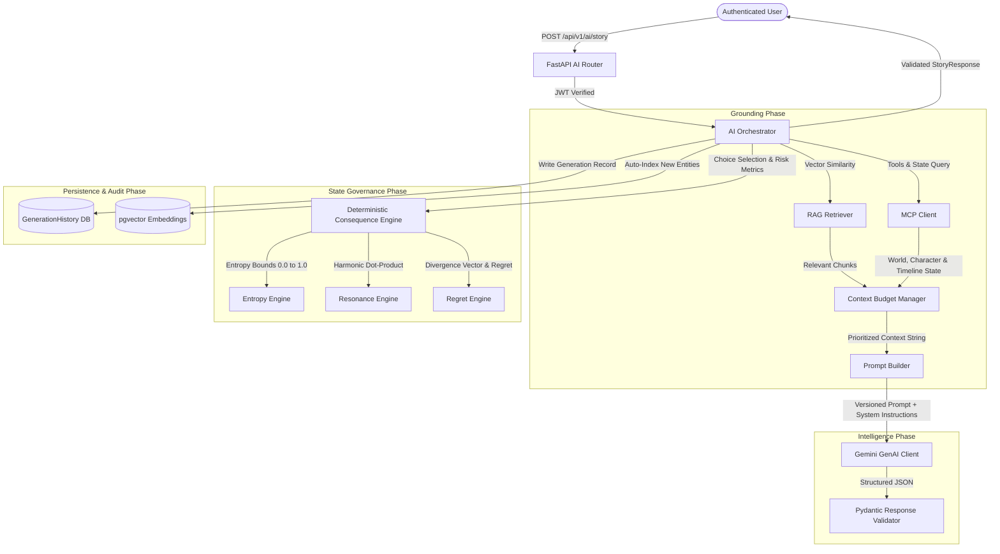

# KSHAN — Gemini AI Orchestrator & Consequence Engine Architecture (Phase 4)

> **"One Moment. Infinite Lives. Your choices create worlds that never existed."**

---

## 1. Executive Summary

Phase 4 establishes the central intelligence layer of the **KSHAN** platform:
1. **Google Gemini GenAI Client**: Supports structured output generation with automated validation against strict Pydantic schemas, with a deterministic zero-key fallback (`MockGeminiProvider`).
2. **Dynamic Context Budgeting & Grounding**: Coordinates RAG semantic retrieval and MCP tool context within strict token budgets.
3. **Deterministic Mathematical Consequence Engine**: Mathematical state authority for entropy, resonance, regret, and divergence calculations (Gemini generates qualitative narrative; the engine governs physical laws).
4. **Persistent Generation Telemetry**: Stores all prompts, outputs, token consumption, latency, and context sources in the `generation_histories` database table.
5. **Protected FastAPI AI Endpoints**: Authenticated endpoints (`/api/v1/ai/*`) enforcing tenant isolation.

---

## 2. Architecture & Request Pipeline



---

## 3. Deterministic Mathematical State Engines

Gemini is strictly prohibited from generating raw numerical state transitions. All timeline physics are calculated deterministically:

### 3.1 Entropy Engine (`entropy_engine.py`)
- **Formula**:
  $$\Delta S = (\text{risk} \times 0.25) - (\text{stabilizer\_bonus}) + \text{noise}$$
  $$S_{new} = \text{clamp}(S_{current} + \Delta S, 0.0, 1.0)$$
- Enforces system chaos limits and triggers timeline collapse warnings if $S > 0.85$.

### 3.2 Resonance Engine (`resonance_engine.py`)
- Calculates harmonic alignment between chosen actions and world archetypes:
  $$\text{Resonance} = \frac{\mathbf{v}_{action} \cdot \mathbf{v}_{world}}{\|\mathbf{v}_{action}\| \|\mathbf{v}_{world}\|} \times (1.0 + \text{faction\_bonus})$$
- Yields a bounded multiplier between $0.0$ and $1.0$.

### 3.3 Regret & Divergence Engine (`regret_engine.py`)
- Quantifies psychological divergence from the prime timeline:
  $$\text{Divergence} = \sqrt{\sum (\mathbf{state}_{current} - \mathbf{state}_{prime})^2}$$
  $$\Delta R = \text{Divergence} \times \text{risk\_factor} \times (1.0 - \text{resonance})$$

---

## 4. AI Endpoints (`/api/v1/ai`)

| Endpoint | Method | Description |
| :--- | :---: | :--- |
| `/api/v1/ai/story` | `POST` | Generates rich narrative prose and **exactly 3** branching choices. |
| `/api/v1/ai/branch` | `POST` | Generates 3 divergent choice nodes from current timeline node. |
| `/api/v1/ai/future-you` | `POST` | Generates empathetic, fictional Future You persona responses. |
| `/api/v1/ai/world` | `POST` | Generates procedural world lore and auto-indexes into RAG. |
| `/api/v1/ai/character` | `POST` | Generates character personas and auto-indexes into RAG. |
| `/api/v1/ai/analyze-decision` | `POST` | Provides philosophical weight and parallel-path insights. |

---

## 5. Test Verification Status

```
======================= 45 passed in 16.82s =======================
Phase 1: Relational Schema & Tenant Isolation (7/7 Passed)
Phase 2: RAG, Embeddings & Vector Similarity Search (13/13 Passed)
Phase 3: Real MCP Server & Tool Integration (9/9 Passed)
Phase 4: Gemini AI Orchestrator & Consequence Engine (16/16 Passed)
```
