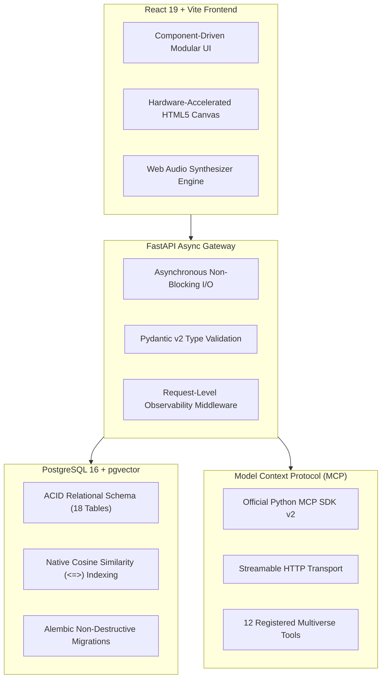

# KSHAN — Core Engineering Architecture & Technology Rationale

## Architectural Foundations

KSHAN was designed to solve the fundamental flaw in traditional generative text adventures: **state hallucination and timeline collapse**. By pairing asynchronous backend orchestration with mathematical state bounding and vector search, KSHAN delivers a truly persistent, deterministic multiverse simulation.

---

## Technical Stack Justification

### 1. Why FastAPI?
- **High Concurrency & Async I/O**: Generative LLM requests, vector distance queries, and graph traversals are inherently I/O-bound. FastAPI's native `asyncio` loop handles thousands of concurrent requests without blocking.
- **Type Safety via Pydantic v2**: Every API payload is strictly validated at runtime with automated OpenAPI generation (`/api/docs`).

### 2. Why React 19 + Vite?
- **Instant Hot Module Replacement (HMR)**: Vite provides sub-second build times and clean production bundling (279 kB gzip).
- **Direct Canvas & Web Audio Integration**: Allows seamless rendering of 120-particle cosmic starfields and dual-oscillator ambient soundscapes without bulky 3D engine overhead.

### 3. Why PostgreSQL + pgvector?
- **Unified Relational & Vector Storage**: Avoids operational overhead and synchronization lag of managing a separate vector database (e.g. Pinecone). Relational metadata, timeline nodes, and 768-dimensional embeddings reside in the same transactional PostgreSQL instance.
- **ACID Transaction Guarantees**: A choice execution atomically creates the child branch, timeline node, decision record, state snapshot, and memory vector in a single committed transaction.

### 4. Why Model Context Protocol (MCP)?
- **Standardized AI Tool Interface**: MCP decouples AI context retrieval from LLM providers. Any compatible AI client can discover and execute KSHAN's 12 multiverse tools over Streamable HTTP.
- **Dynamic Context Assembly**: Tools like `query_memories_rag` and `get_story_context` inject precise multiverse states directly into the AI's working memory.

### 5. Why Multi-Stage Docker & GitHub Actions?
- **Production Reproducibility**: Multi-stage builds produce ultra-lightweight images with dedicated non-root users (`appuser`, `mcpuser`) and health checks.
- **Automated CI Quality Gate**: GitHub Actions runs 58 automated tests, builds the React bundle, and validates container builds on every pull request.
