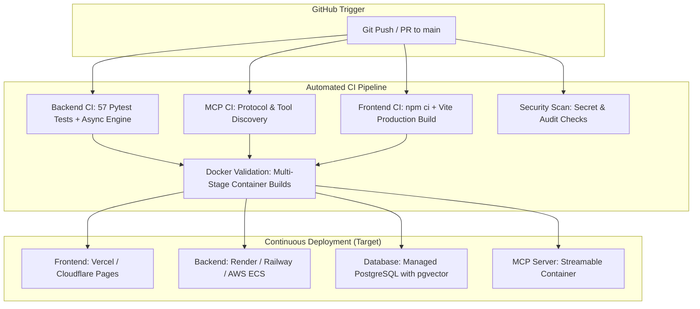

# KSHAN — Continuous Integration & Continuous Delivery (CI/CD) Architecture

## Overview

The KSHAN platform employs an automated CI/CD pipeline built on **GitHub Actions**. Every commit and pull request against `main` is subjected to automated testing, static validation, multi-stage Docker builds, and security scans.

---

## Pipeline Architecture

---

## CI Pipeline Stages

### 1. Backend CI Job (`backend-ci`)
- **Environment**: Python 3.12 runner with dependency caching.
- **Scope**:
  - Full execution of 57+ unit and integration tests across Auth, Relational Models, pgvector RAG, Gemini AI Orchestrator, Deterministic Multiverse, and Scenarios.
  - Zero-external API requirement (uses deterministic Mock Gemini & Mock Vector providers during CI).
  - Validation of non-destructive schema migrations.

### 2. MCP Server CI Job (`mcp-ci`)
- **Environment**: Python 3.12 runner with official `mcp` SDK.
- **Scope**:
  - Validates Streamable HTTP transport initialization.
  - Verifies 12 registered MCP tools (`read_timeline_state`, `query_memories_rag`, `search_world_knowledge`, `execute_reality_choice`, etc.).
  - Validates client-server authentication and tenant isolation.

### 3. Frontend CI Job (`frontend-ci`)
- **Environment**: Node.js 20 runner with npm cache.
- **Scope**:
  - Strict dependency installation via `npm ci`.
  - Vite production bundle compilation (`npm run build`).
  - Verifies that static HTML, CSS, and JS bundles generate cleanly without warnings or missing exports.

### 4. Docker Validation Job (`docker-validation`)
- **Environment**: Docker Buildx on Ubuntu runner.
- **Scope**:
  - Executes multi-stage builds for `backend/Dockerfile`, `mcp-server/Dockerfile`, and `frontend/Dockerfile`.
  - Verifies non-root user permissions (`appuser`, `mcpuser`) and healthcheck declarations.

### 5. Security & Secret Scan Job (`security-audit`)
- **Scope**:
  - Scans for unencrypted private keys, `.pem` files, or committed `.env` files.
  - Confirms `.env.example` remains sanitized.
