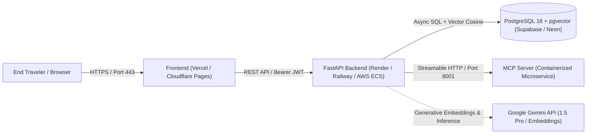

# KSHAN — Production Cloud Deployment Architecture

## Deployment Topology



---

## 1. Managed Database Setup (PostgreSQL + pgvector)

KSHAN requires PostgreSQL 16+ with the `pgvector` extension enabled.

### Recommended Providers
1. **Supabase / Neon**: Native pgvector support with async connection pooling.
2. **AWS Aurora PostgreSQL / RDS**: PostgreSQL 16 with `vector` extension.

### Initialization Commands
```sql
-- Ensure pgvector extension is activated
CREATE EXTENSION IF NOT EXISTS vector;
CREATE EXTENSION IF NOT EXISTS "uuid-ossp";
```

---

## 2. Backend Deployment (Render / Railway / AWS ECS)

### Docker Deployment
1. Set the Docker context to root and Dockerfile to `backend/Dockerfile`.
2. Configure environment variables in your cloud dashboard:
   - `ENVIRONMENT=production`
   - `DATABASE_URL=postgresql+asyncpg://<user>:<password>@<db-host>:5432/<db-name>`
   - `JWT_SECRET_KEY=<generate-strong-64-char-secret>`
   - `BACKEND_CORS_ORIGINS=https://kshan.ai,https://www.kshan.ai`
   - `GEMINI_API_KEY=<your-google-gemini-api-key>`
   - `EMBEDDING_DIMENSION=768`
   - `MCP_SERVER_URL=http://mcp-server:8001/mcp`
3. Expose port `8000`.

### Health & Readiness Probes
- **Liveness Probe**: `GET /api/v1/health/live` (HTTP 200)
- **Readiness Probe**: `GET /api/v1/health/ready` (HTTP 200 verifying DB & schema)

---

## 3. Frontend Deployment (Vercel / Cloudflare Pages)

### Configuration
1. **Root Directory**: `frontend`
2. **Build Command**: `npm run build`
3. **Output Directory**: `dist`
4. **Environment Variables**:
   - `VITE_API_URL=https://api.kshan.ai/api/v1`

---

## 4. MCP Server Deployment

Deploy the container using `mcp-server/Dockerfile` with:
- **Port**: `8001`
- **Internal Service Mesh**: Accessible by the backend at `http://mcp-server:8001/mcp`.
- **Healthcheck**: `GET /mcp`
