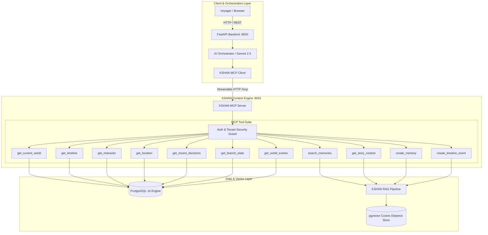
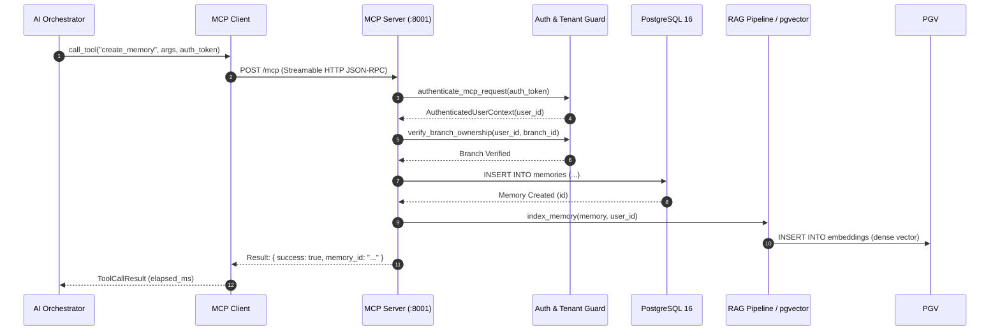

# KSHAN — Model Context Protocol (MCP) Architecture

> **"One Moment. Infinite Lives. Your choices create worlds that never existed."**

---

## 1. Executive Summary

KSHAN's Model Context Protocol (MCP) layer decouples narrative intelligence and AI generation from raw database queries. The **KSHAN Multiverse Context Server** is an autonomous microservice built on the official MCP Python SDK (`mcp>=2.0.0`) that exposes standard tools, resources, and prompt templates to AI orchestrators.

Every tool call enforces **strict cryptographic JWT authentication** and **tenant-isolated cross-user security checks**, ensuring an alternate reality voyager can never read or mutate another traveler's timeline or memory vault.

---

## 2. Architecture & Integration Topology



---

## 3. Tool Suite Reference

| Tool Name | Type | Description | Key Parameters |
| :--- | :--- | :--- | :--- |
| `get_current_world` | Read | Retrieves cosmos laws, factions, and world chronicle | `auth_token`, `scenario_id` |
| `get_timeline` | Read | Returns ordered timeline sequence for a reality branch | `auth_token`, `branch_id`, `limit` |
| `get_timeline_node` | Read | Fetches specific node narrative, choices & consequences | `auth_token`, `node_id` |
| `get_character` | Read | Returns character backstory, psychology & dialogue style | `auth_token`, `character_id` |
| `get_location` | Read | Returns realm location description and danger rating | `auth_token`, `location_id` |
| `search_memories` | Read / RAG | Vector similarity retrieval over pgvector embeddings | `auth_token`, `query`, `branch_id`, `top_k` |
| `get_recent_decisions`| Read | Returns recent turning points and chosen paths | `auth_token`, `branch_id`, `limit` |
| `get_branch_state` | Read | Returns branch entropy, resonance & state metrics | `auth_token`, `branch_id` |
| `get_world_events` | Read | Returns historical chronicle of timeline events | `auth_token`, `branch_id` |
| `get_story_context` | Read / Composite | Aggregates world, branch state, decisions & RAG context | `auth_token`, `branch_id`, `query` |
| `create_memory` | Write / RAG | Persists memory and auto-indexes into pgvector | `auth_token`, `branch_id`, `title`, `content` |
| `create_timeline_event`| Write / RAG| Persists timeline event and auto-indexes into pgvector | `auth_token`, `branch_id`, `story_text`, `era_year` |

---

## 4. MCP Sequence Flow: Write Tool & Dynamic RAG Indexing



---

## 5. Resources & Prompts

### Resources
- `kshan://world/{scenario_id}`: Static world rules and realm topology.
- `kshan://timeline/{branch_id}`: Full chronological timeline history.
- `kshan://memories/{branch_id}`: Unlocked memory shards for an active branch.

### Prompts
- `future_you_context`: Grounding prompt template for conversational interaction with Future You.

---

## 6. Development & Inspection with MCP Inspector

To inspect and test tools interactively using the official MCP Inspector:

```bash
# 1. Start MCP server
uvicorn mcp_server.app.server:app --host 0.0.0.0 --port 8001

# 2. Launch MCP Inspector in browser
npx @modelcontextprotocol/inspector http://localhost:8001/mcp
```
