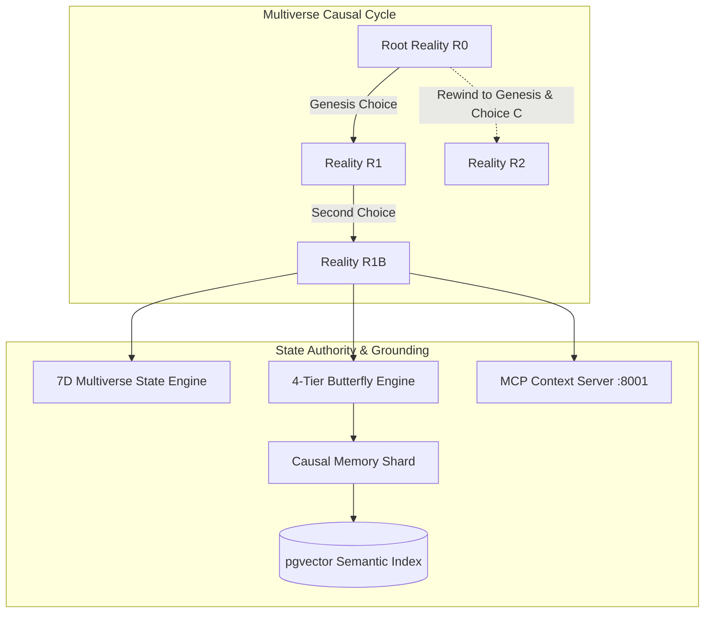
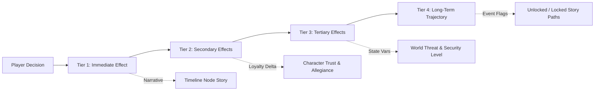

# KSHAN — Persistent Multiverse & Butterfly Effect Engine Architecture (Phase 5)

> **"One Moment. Infinite Lives. Your choices create worlds that never existed."**

---

## 1. Overview & Core Philosophy

Phase 5 transitions **KSHAN** from an AI narrative generation tool into a **persistent, deterministic branching multiverse simulation**.
When a traveler makes a choice at any timeline node, KSHAN spawns an immutable child `RealityBranch` with mathematical state transitions, 4-tier causal ripples (butterfly effect), persistent causal memories, and dynamic RAG vector indexing.



---

## 2. 7-Dimensional Multiverse State Vector

All multiverse physics are governed by a 7D state vector strictly clamped to $[0.0, 1.0]$ with NaN safety protections:

| Dimension | Range | Description |
| :--- | :---: | :--- |
| **`entropy`** ($S$) | $0.0 \to 1.0$ | System chaos, timeline volatility, and reality degradation. |
| **`resonance`** ($R$) | $0.0 \to 1.0$ | Psychological harmony and archetype alignment with the cosmos. |
| **`regret`** ($\rho$) | $0.0 \to 1.0$ | Divergence consequence pain relative to initial traveler intention. |
| **`destiny_shift`** ($\Delta D$) | $0.0 \to 1.0$ | Net cumulative trajectory divergence from the Root Reality ($R_0$). |
| **`world_stability`** | $0.0 \to 1.0$ | Environmental coherence and institutional infrastructure strength. |
| **`social_stability`** | $0.0 \to 1.0$ | Faction alignment, public order, and civilian trust levels. |
| **`technology_level`** | $0.0 \to 1.0$ | Technological sophistication and synthetic capability. |

### Mathematical State Formulas

#### 2.1 Entropy Delta ($\Delta S$)
$$\Delta S = \left(w_{risk} \times 0.5 + \text{risk} \times 0.3 + \text{depth} \times 0.015 + \text{contradiction} \times 0.12 + \text{disruption} \times 0.15\right) \times \max(0.2, 1.0 - S_{current})$$
$$S_{new} = \text{clamp}(S_{current} + \Delta S, 0.0, 1.0)$$

#### 2.2 Resonance Delta ($\Delta R$)
$$\Delta R = \text{ArchetypeAffinity} + \text{CharacterAlignmentBonus} - (\text{risk} \times 0.12)$$
$$R_{new} = \text{clamp}(R_{current} + \Delta R, 0.0, 1.0)$$

#### 2.3 Regret Delta ($\Delta \rho$)
$$\Delta \rho = (w_{sev} \times 0.4) + (\text{risk\_factor} \times 0.2) + (1.0 - \text{intent\_alignment}) \times 0.25 + \text{loss\_factor} \times 0.2$$
$$\rho_{new} = \text{clamp}(\rho_{current} + \Delta \rho, 0.0, 1.0)$$

#### 2.4 Destiny Shift ($\Delta D$)
$$\Delta D = (\text{Divergence} \times 0.15) + (|\Delta S| \times 0.10) + \text{MajorDecisionBonus}$$
$$D_{new} = \text{clamp}(D_{current} + \Delta D, 0.0, 1.0)$$

---

## 3. 4-Tier Butterfly Effect Engine

When a choice is made, causal reverberations cascade across four distinct layers:



1. **Tier 1 (Immediate)**: Instant sensory and narrative consequence on the active timeline node.
2. **Tier 2 (Secondary)**: Character trust adjustments (e.g. Aria $+0.15$ for Defiance, Commander Vane $-0.20$ for Defiance).
3. **Tier 3 (Tertiary)**: Structural changes to world variables (e.g. `danger_level: "elevated"`, `surveillance_grid: "heightened_alert"`).
4. **Tier 4 (Long-Term)**: Permanent unlocking/locking of future narrative pathways.

---

## 4. Rewind & Time Travel Mechanics

In KSHAN, rewinding to an earlier node **never destroys history**:
- Instead of deleting downstream nodes, KSHAN forks a new parallel reality branch ($R_2$) rooted at that historical moment.
- The original divergent branches ($R_1, R_{1B}$) remain 100% accessible, preserving the multiverse continuum.

---

## 5. API Reference (`/api/v1/multiverse`)

| Endpoint | Method | Description |
| :--- | :---: | :--- |
| `/api/v1/multiverse/choose` | `POST` | Primary gameplay loop: executes choice, updates state, creates child branch & node, indexes RAG. |
| `/api/v1/multiverse/rewind` | `POST` | Rewinds to a historical node, spawning a parallel fork branch. |
| `/api/v1/multiverse/branch` | `POST` | Explicit creation of a root reality branch. |
| `/api/v1/multiverse/tree/{scenario_id}` | `GET` | Returns graph-ready topology (`nodes` and `edges`) for visualization. |
| `/api/v1/multiverse/branch/{branch_id}` | `GET` | Retrieves full state, chronological timeline, and metadata. |
| `/api/v1/multiverse/compare/{branch_a}/{branch_b}` | `GET` | Computes multidimensional delta matrix between two branches. |

---

## 6. End-to-End Verification Status

```
======================= 56 passed in 21.02s =======================
Phase 1: Relational Schema & Tenant Isolation (7/7 Passed)
Phase 2: Production RAG, Embeddings & Vector Search (13/13 Passed)
Phase 3: Official MCP Python SDK Server & Client (9/9 Passed)
Phase 4: Gemini AI Orchestrator & Consequence Engine (16/16 Passed)
Phase 5: Persistent Multiverse & Butterfly Effect Engine (11/11 Passed)
```
