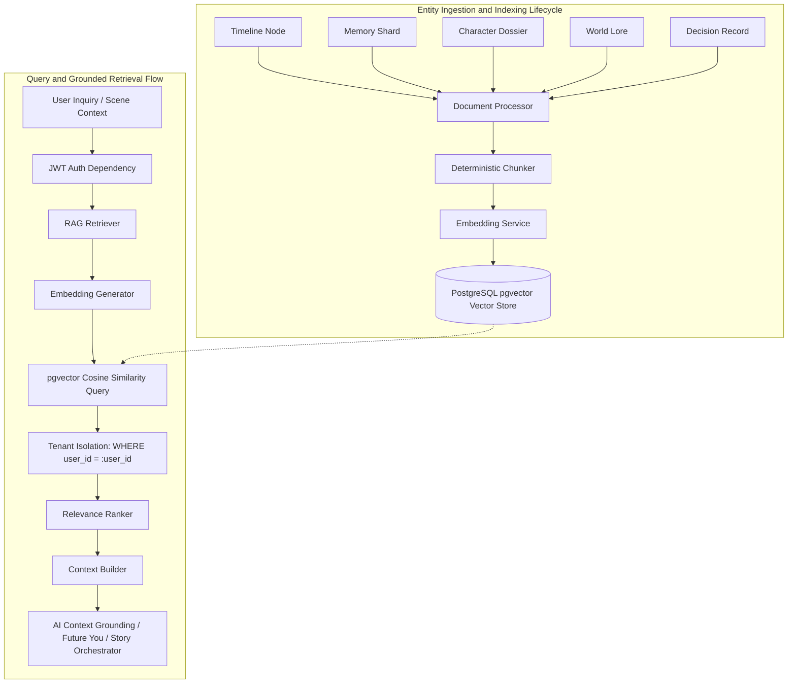

# KSHAN — Retrieval-Augmented Generation (RAG) Architecture

**"One Moment. Infinite Lives. Your choices create worlds that never existed."**

---

## 1. What RAG Means in KSHAN

In **KSHAN**, the multiverse branches infinitely with each user choice. As timelines diverge, characters evolve, memories shard, worlds undergo political/cosmic shifts, and decisions accumulate irreversible consequences.

Retrieval-Augmented Generation (RAG) is the deterministic factual anchor of the AI Multiverse Engine. It guarantees that:
1. When generating the next story segment or consequence, the AI is grounded in the exact historical decisions and world state of the active branch.
2. When the user dialogues with **"Future You"**, the alternate persona cites genuine memories, choices, and character encounters experienced in that specific branch.
3. Every piece of context provided to the LLM is verifiable, cited, and scoped strictly to the authenticated user.

---

## 2. Why KSHAN Uses RAG

- **Overcoming Context Limits**: Multiverse histories can span dozens of eras, nodes, and parallel timelines. RAG selects the top-k most semantically relevant memories and lore instead of stuffing the prompt.
- **Strict Multi-Tenant Isolation**: Ensures a player's private timeline branches and custom choices are never leaked to or mixed with another player's reality.
- **State Consistency & Hallucination Prevention**: Prevents the LLM from inventing contradictory backstories for established characters (e.g. Aria) or forgetting pivotal decisions made 10 turns earlier.

---

## 3. Architecture & Data Flow



---

## 4. Embedding Configuration & Dynamic Vector Dimensions

KSHAN does **not** hardcode vector dimensions:
- Configuration is loaded via `Settings.EMBEDDING_DIMENSION` (default `768` for Gemini `text-embedding-004`).
- Supports `1536` or custom dimensions dynamically.
- `EmbeddingRecord.embedding_vector` uses SQLAlchemy `Vector(settings.EMBEDDING_DIMENSION)`.

### Embedding Providers:
- **`GeminiEmbeddingProvider`**: Production provider using the official Google GenAI SDK. Validates output vector dimensions and handles padding/truncation with L2 re-normalization if model dimensions deviate.
- **`MockEmbeddingProvider`**: Deterministic subword token projection provider with L2 unit normalization for offline development and test automation without requiring an API key.

---

## 5. Document Processing & Deterministic Chunking

The `DocumentProcessor` transforms all 18 KSHAN entity models into rich natural language representations:

| Entity Type | Extracted Fields & Headers | Metadata Keys |
| :--- | :--- | :--- |
| **`timeline_node`** | `[TIMELINE EVENT]` Era, depth, narrative, sensory cue, butterfly impact, choices | `user_id`, `branch_id`, `era_year`, `depth_level` |
| **`memory`** | `[MEMORY SHARD]` Title, emotional tone, memory type, clarity level, content | `user_id`, `branch_id`, `node_id`, `emotional_tone` |
| **`decision`** | `[PLAYER DECISION]` Chosen action, rationale, divergence magnitude | `user_id`, `node_id`, `chosen_choice_id` |
| **`character`** | `[CHARACTER]` Name, role, faction, backstory, dialogue voice | `user_id`, `world_id`, `role`, `faction` |
| **`world`** | `[WORLD LORE]` Name, cosmos type, cosmology, physical/metaphysical laws | `user_id`, `scenario_id`, `cosmos_type` |
| **`location`** | `[LOCATION]` Name, zone, description, atmosphere, danger rating | `user_id`, `world_id`, `realm_zone` |

---

## 6. Multi-Tenant Isolation & Query Enforceability

Multi-tenant security is enforced at the **SQL query level**, never in prompt instructions:

```sql
SELECT document_content, metadata_payload, 1.0 - (embedding_vector <=> :query_vector) AS similarity_score
FROM embeddings
WHERE user_id = :authenticated_user_id
  AND (branch_id = :active_branch_id OR branch_id IS NULL)
  AND entity_type IN (:entity_types)
ORDER BY embedding_vector <=> :query_vector ASC
LIMIT :top_k;
```

---

## 7. Stale Vector Invalidation & Entity Lifecycle

1. **On Entity Update**:
   - `rag_pipeline.index_memory()` or `rag_pipeline.index_timeline_node()` is triggered.
   - Any prior embeddings matching `(user_id, entity_type, entity_id)` are purged.
   - New semantic chunks are generated, embedded, and inserted.
2. **On Entity Deletion**:
   - `rag_pipeline.delete_entity_index()` removes all vector records for that entity.
3. **On Branch Deletion / Pruning**:
   - `rag_pipeline.delete_branch_index()` cleans up all branch-scoped vectors.

---

## 8. API Reference & Example

### Endpoint: `POST /api/v1/rag/search`
**Headers**: `Authorization: Bearer <JWT_ACCESS_TOKEN>`

#### Request Payload:
```json
{
  "query": "What happened when I touched the crystal at Varanasi?",
  "branch_id": "branch-uuid-42",
  "top_k": 5,
  "similarity_threshold": 0.3
}
```

#### Response Payload:
```json
{
  "success": true,
  "message": "Multiverse context retrieved successfully",
  "data": {
    "query": "What happened when I touched the crystal at Varanasi?",
    "results_count": 2,
    "results": [
      {
        "content": "[MEMORY SHARD] Title: First Resonance Shard | Emotional Tone: epiphany\nType: origin | Vividness Clarity: 1.0\nContent: A vision of an extinguished sun in ancient Kashi.",
        "score": 0.875,
        "document_type": "memory",
        "entity_id": "mem-uuid-1",
        "document_title": "Memory Shard: First Resonance Shard",
        "metadata": {
          "user_id": "user-uuid-1",
          "branch_id": "branch-uuid-42",
          "emotional_tone": "epiphany"
        }
      }
    ],
    "context": "=== RETRIEVED KSHAN MULTIVERSE CONTEXT ===\n\n[MEMORIES & PARALLEL ECHOES]\n• (Relevance: 87%) [MEMORY SHARD] Title: First Resonance Shard...",
    "retrieval_time_ms": 4.12
  }
}
```
